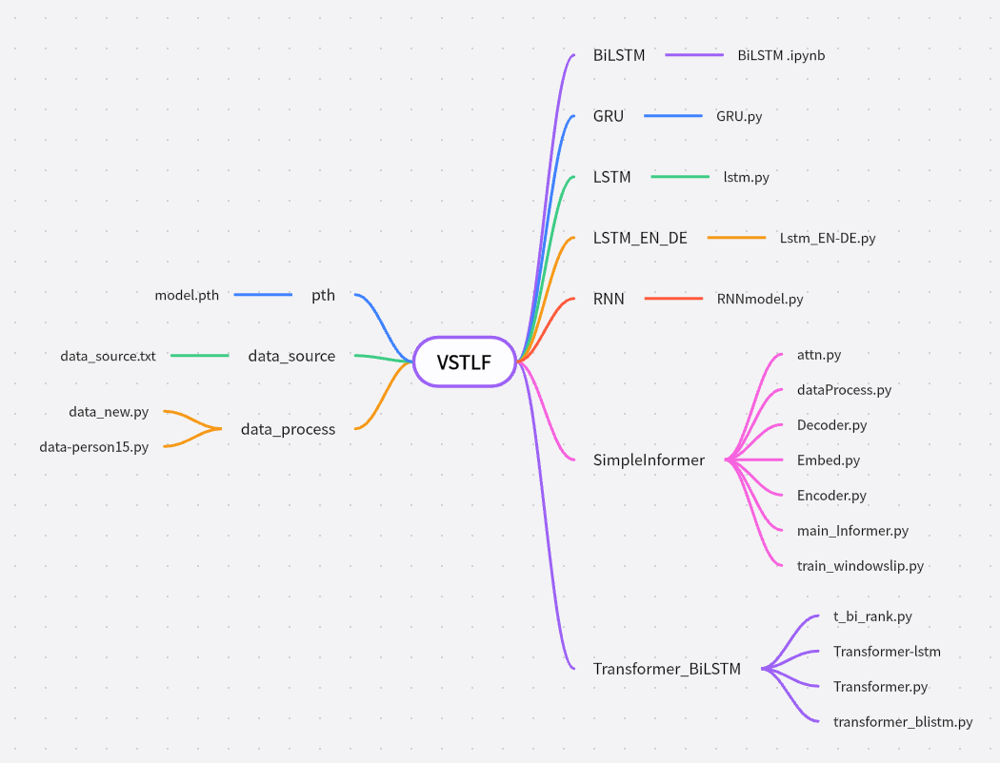
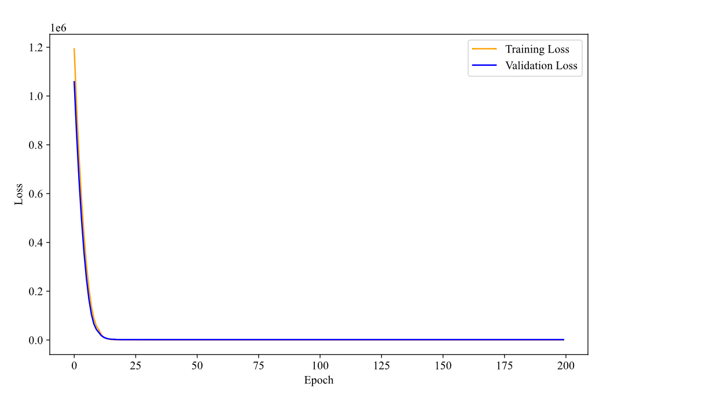
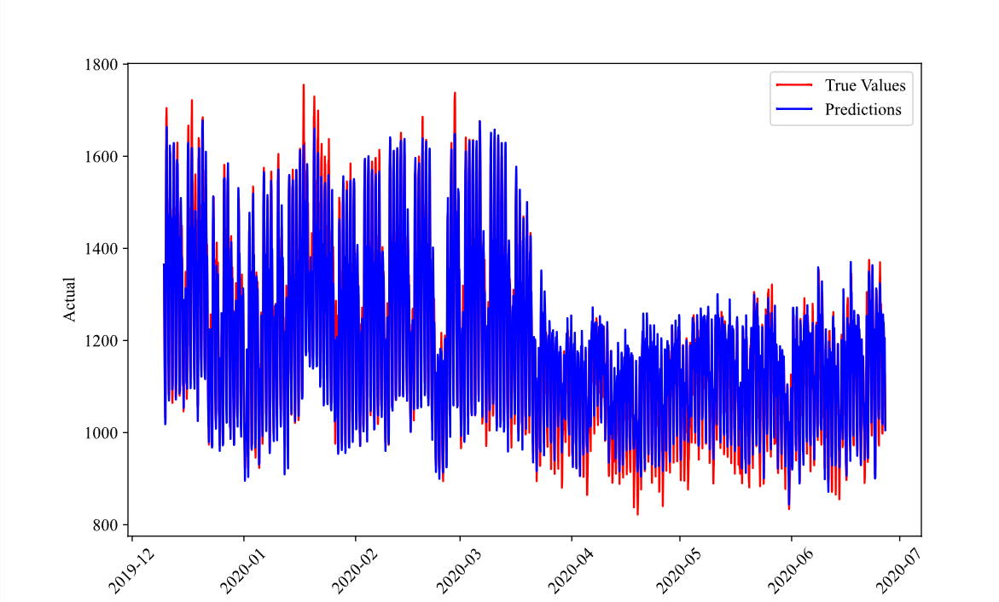
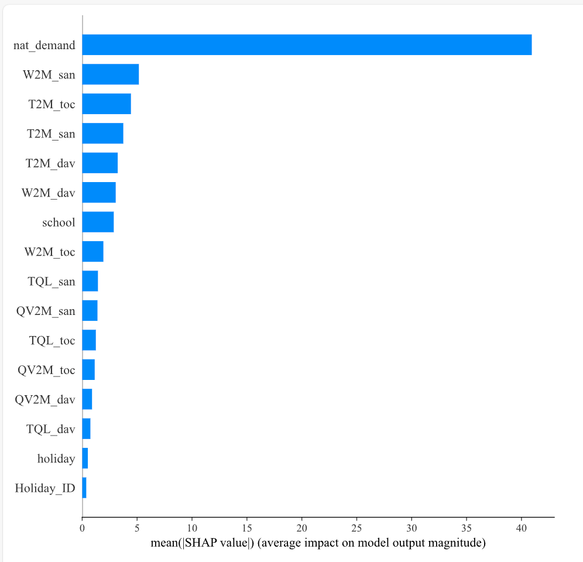
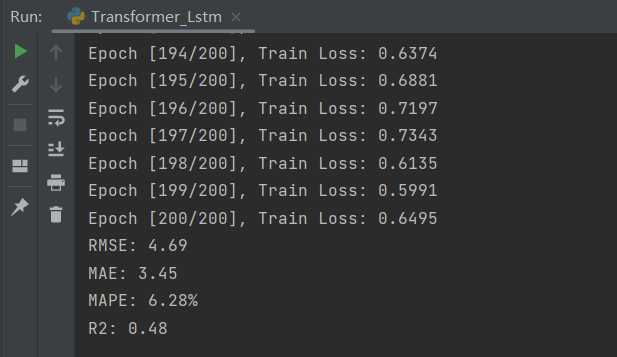

# Very Short-Term Power Load Forecasting with Transformer and BiLSTM

This project focuses on Very Short-Term Load Forecasting (VSTLF) using a hybrid model combining Transformer architecture and Bidirectional Long Short-Term Memory (BiLSTM) networks. Leveraging a public dataset, we perform statistical analysis to identify key features influencing power load forecasting and train the hybrid model. Our approach surpasses several state-of-the-art methods in predictive performance. Additionally, we use Shapley Additive Explanations (SHAP) for feature importance analysis, enhancing the model's interpretability.


## Project Map



## Requirements
* python>=3.8

* pytorch>=1.12.1

* numpy>=1.15.4

* pandas>=1.5.2

* shap==0.46.0

## The root directory name must be VSTLF

## Directory Structure

- data-source: Data source links
- data-process:Data processing, including normalization and dataset splitting
- **Transformer-LSTM**, **Transformer** directories: Corresponding model structures, hyperparameters, training strategies, and performance evaluation
- pth:Stores model weights after training


## Training

* STEP 1. Download the dataset and run data preprocessing.
```
python data_raw16.py
python data_person5.py  # Person-related correlation Top 5 feature data
python data_person15.py  # Person-related correlation Top 15 feature data
```
* STEP 2. Run the corresponding model for training and performance evaluation.
```
# example
python Transformer_BiLSTM.py  #Includes interpretability analysis
python lstm.py
python GRU.py
python Lstm_EN-DE.py
python Transformer_lstm.py
python Transformer.py
python Transformer_BiLSTM_Pearson5.py  #Pearson5 interpretability analysis
python Transformer_BiLSTM_Pearson15.py  #Pearson15 interpretability analysis
python Transformer_BiLSTM_SHAP5.py  #SHAP5 interpretability analysis
```
## Training Loss Curve

## Prediction


## Shap


## Results
